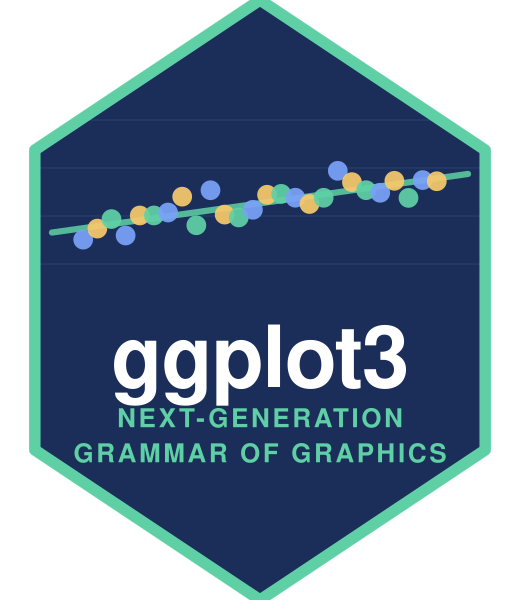

# ggplot3

**Data Visualisations, Reimagined, Using a Next-Generation Grammar of Graphics**

ggplot3 keeps the grammar you already know — `data + aes() + geoms + scales
+ coords + facets + theme`, composed with `+` — and extends it: native
interactivity, animation, an exact-data export, and a much larger geom
catalog spanning layout diagrams, ML diagnostics, and clinical reporting.

One plot object renders to a standalone **SVG** or a self-contained
**interactive HTML page** from a single computed-geometry buffer, so the
two targets can never disagree.

## Install

```r
# install.packages("remotes")
remotes::install_github("maheshdivakaran/ggplot3")
```

## Quick start

```r
library(ggplot3)

p <- ggplot3(cars, aes(speed, dist)) +
  geom_point(alpha = 0.6) +
  geom_smooth(method = "lm") +
  labs(
    title = "Stopping distance rises with speed",
    x = "Speed (mph)", y = "Distance (ft)"
  ) +
  theme_minimal()

p                                            # static image in the viewer
render(p, file = "plot.svg")                 # save the SVG
render(p + interact(), file = "plot.html")   # interactive version
plot_data(p)                                 # exactly the values drawn
```

## What's new here

**Static first, interactive on request.** `render(p)` gives you an image.
Adding `+ interact()` switches the default target to a self-contained HTML
page with hover tooltips, scroll-to-zoom, and brush-to-zoom.

```r
render(p + interact(tooltip = c("model", "hwy"), brush = TRUE))
render(p + animate(year))     # frame scrubber with play/pause
```

Interactivity and animation are grammar verbs rather than separate
packages or a post-hoc conversion — both consume the same geometry buffer
as the static renderer.

**Exact data export.** What a plot draws is often not what went in: stats
aggregate, positions stack, facets split. `plot_data()` returns precisely
the values drawn, in data units, with no scratch columns:

```r
plot_data(ggplot3(cars, aes(speed)) + geom_histogram(bins = 5))
#>        x  y ymin ymax  xmin  xmax
#> 1  6.625  6    0    6  4.00  9.25
#> 2 11.875 17    0   17  9.25 14.50
#> ...
write_plot_data(p, "figure-1-data.csv")   # publish the numbers with the figure
```

**One geom catalog, no extension hunting.** Violin, ridgeline, Sankey,
treemap, network, radar, SHAP, ROC, Kaplan-Meier, forest, and CONSORT are
all in the box, using the same `aes()` and the same `+`.

## The geom catalog

| Group | Geoms |
|---|---|
| **Essentials** | `point` `jitter` `line` `path` `step` `area` `ribbon` `segment` `hline` `vline` `text` `tile` |
| **Statistical** | `bar` `col` `histogram` `density` `boxplot` `violin` `smooth` `errorbar` `pointrange` `dumbbell` `waterfall` |
| **Layout** | `radar` `ridgeline` `sankey`/`alluvial` `treemap` `network` `chord` `parallel` `bump` `funnel` `stream` `upset` |
| **Machine learning** | `shap` `partial_dependence` `confusion_matrix` `calibration` `roc` `lift_gain` `residual` `learning_curve` `silhouette` `embedding` `decision_boundary` `forecast_band` |
| **Clinical / biostatistics** | `km` `cuminc` `forest` `swimmer` `spaghetti` `spider_response` `waterfall_response` `bland_altman` `ae_heatmap` `dose_response` `shift` `consort` |

The layout algorithms are implemented directly: squarified treemaps,
Fruchterman-Reingold force layout, Sankey node stacking, Aalen-Johansen
cumulative incidence, four-parameter log-logistic dose-response fits.

## Customization

```r
ggplot3(iris, aes(Sepal.Length, Sepal.Width, color = Species)) +
  geom_point(size = 3) +
  facet_wrap(Species, scales = "free") +
  scale_x_continuous(
    name = "Sepal length (cm)",
    breaks = c(5, 6, 7, 8),
    labels = function(v) paste0(v, " cm"),
    expand = 0
  ) +
  scale_color_manual(c("#2B6BE0", "#E05A2B", "#12A594")) +
  labs(
    title = "Sepal dimensions by species",
    subtitle = "Fisher's iris data",
    caption = "Source: datasets::iris",
    tag = "A"
  ) +
  theme(
    base = theme_modern(),
    grid_major_x = FALSE,
    legend_position = "bottom",
    plot_title_size = 20
  )
```

Six theme presets — `theme_ggplot3()`, `theme_minimal()`, `theme_classic()`,
`theme_modern()`, `theme_dark()`, `theme_void()` — and 35 individual
settings overridable through `theme()`.

Axis transforms: `scale_x_log10()`, `scale_x_sqrt()`, `scale_x_reverse()`
(and the `y` equivalents). Coordinates: `coord_cartesian()`, `coord_flip()`,
`coord_polar()`.

## Documentation

```r
build_site("docs")   # builds the full site, rendering every gallery
                     # figure with ggplot3 itself
```

Open `docs/index.html`. The **Guide** page walks through the grammar end
to end, including how to add your own geoms; the **Gallery** has a worked
example of every layer.

## Acknowledgements

ggplot3 is an independent implementation, but it stands on a great deal of
prior art and takes its vocabulary directly from it.

The grammar itself comes from Leland Wilkinson's *The Grammar of Graphics*
(Springer, 2005) and, above all, from Hadley Wickham's
[**ggplot2**](https://ggplot2.tidyverse.org), whose API design — `aes()`,
`geom_*()`, `stat_*()`, `scale_*()`, `coord_*()`, `facet_*()`, `theme()`,
and composition with `+` — this package deliberately preserves so the
muscle memory carries over.

The extended catalog follows conventions established by the ggplot2
extension ecosystem and by packages outside it:

| Area | Prior art |
|---|---|
| Ridgeline / joyplots | [ggridges](https://wilkelab.org/ggridges/) |
| Alluvial and Sankey flows | [ggalluvial](https://corybrunson.github.io/ggalluvial/), [ggsankey](https://github.com/davidsjoberg/ggsankey) |
| Network grammar | [ggraph](https://ggraph.data-imaginist.com), [igraph](https://r.igraph.org) |
| Treemaps | [treemapify](https://wilkox.org/treemapify/) |
| Radar / spider charts | [ggradar](https://github.com/ricardo-bion/ggradar) |
| Streamgraphs | [ggstream](https://github.com/davidsjoberg/ggstream) |
| Set intersections | [ggupset](https://github.com/const-ae/ggupset), [UpSetR](https://github.com/hms-dbmi/UpSetR) |
| Chord diagrams | [circlize](https://jokergoo.github.io/circlize_book/) |
| Parallel coordinates | [GGally](https://ggobi.github.io/ggally/) |
| Bump charts | [ggbump](https://github.com/davidsjoberg/ggbump) |
| Rug/label geoms and extras | [ggforce](https://ggforce.data-imaginist.com), [ggrepel](https://ggrepel.slowkow.com), [ggalt](https://github.com/hrbrmstr/ggalt) |
| Interactivity model | [ggiraph](https://davidgohel.github.io/ggiraph/), [plotly](https://plotly-r.com) |
| Animation grammar | [gganimate](https://gganimate.com) |
| Plot composition | [patchwork](https://patchwork.data-imaginist.com), [cowplot](https://wilkelab.org/cowplot/) |
| Survival and clinical figures | [survminer](https://rpkgs.datanovia.com/survminer/), [survival](https://cran.r-project.org/package=survival), [cmprsk](https://cran.r-project.org/package=cmprsk), [swimplot](https://cran.r-project.org/package=swimplot), [consort](https://cran.r-project.org/package=consort) |
| Model explanation plots | [DALEX](https://modeloriented.github.io/DALEX/), [shapviz](https://github.com/ModelOriented/shapviz), [iml](https://christophm.github.io/iml/), [yardstick](https://yardstick.tidymodels.org) |
| Colour theory | [Okabe & Ito](https://jfly.uni-koeln.de/color/)'s colourblind-safe palette; [scales](https://scales.r-lib.org), [viridis](https://sjmgarnier.github.io/viridis/) |
| Tick placement | Paul Heckbert, "Nice Numbers for Graph Labels", *Graphics Gems* (1990) |
| Treemap layout | Bruls, Huizing & van Wijk, "Squarified Treemaps" (2000) |
| Force layout | Fruchterman & Reingold, "Graph Drawing by Force-Directed Placement" (1991) |
| Streamgraph baselines | Byron & Wattenberg, "Stacked Graphs — Geometry & Aesthetics" (2008) |

Implementation note: ggplot3 is written from scratch on
[S7](https://rconsortium.github.io/S7/) rather than building on these
packages, so the only hard dependency is S7 itself. The packages above are
credited as design references, not as code ancestry — no code is copied
from any of them.

## License

MIT © Mahesh Divakaran
